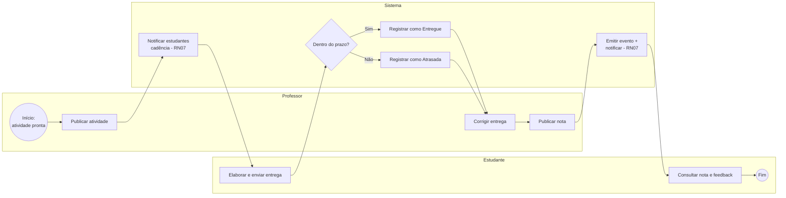

# BPMN — Entrega e Correção de Atividade

Processo de negócio principal do Cátedra. Imagem renderizada:
`bpmn/entrega-correcao.png`. O diagrama Mermaid abaixo renderiza no GitHub.

## Raias (lanes)

- **Professor** — publica a atividade, corrige e publica a nota.
- **Estudante** — elabora/envia a entrega e consulta o resultado.
- **Sistema** — notifica, valida prazo, registra estado e emite eventos.

## Fluxo do processo

1. **Professor** publica a atividade (com prazo). *(RN01, RN03)*
2. **Sistema** notifica os estudantes da turma **respeitando a cadência de cada
   um**. *(RN07)*
3. **Estudante** elabora e envia a entrega (pode reenviar até o prazo). *(RN04)*
4. **Sistema** verifica o gateway **"Dentro do prazo?"**: *(RN03)*
   - **Sim** → registra como **Entregue**;
   - **Não** → registra como **Atrasada** (ou recusa, se a atividade bloquear
     atrasos).
5. **Professor** corrige a entrega (nota + comentário) e **publica** a nota.
6. A nota só fica visível ao estudante **após a publicação**. *(RN05)*
7. **Sistema** emite o evento `nota.publicada` e notifica o estudante (de novo,
   respeitando a cadência). *(RN07)*
8. **Estudante** consulta nota e feedback. **Fim.**

## Diagrama (Mermaid)

> **Observação (RN05):** a transição para "nota publicada" é o único ponto em
> que a nota se torna visível ao estudante; é também o evento que dispara a
> notificação via barramento publish-subscribe (ver `docs/arquitetura.md`,
> ADR-003).

> **Arquivo BPMN 2.0 (XML):** o arquivo `catedra-processos.bpmn` (abre no
> bpmn.io / Camunda Modeler) reúne **três** processos: *Entrega e Correção de
> Atividade* (este), *Notificações Adaptativas (Modo Foco)* e *Formação de Grupo
> de Trabalho* — este último cobrindo a formação/gestão de grupos (RN09) e a
> entrega/nota coletiva (RN10).
