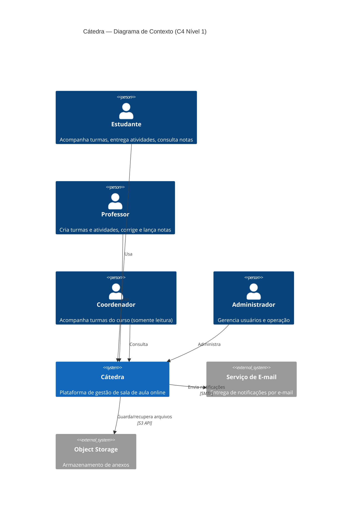
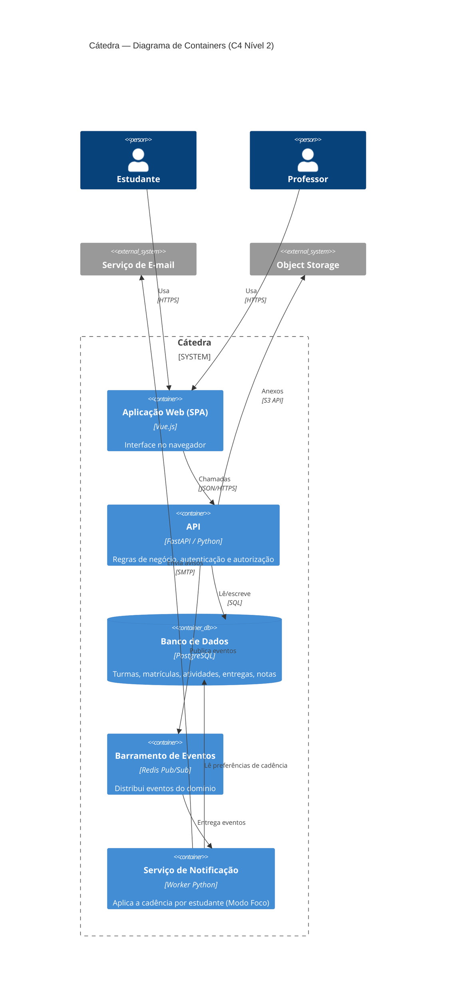

# Arquitetura de Software — Cátedra

## 1. Estilo arquitetural escolhido: **Híbrido (Camadas + Publish-Subscribe)**

O Cátedra adota uma arquitetura **híbrida**:

- O **núcleo do sistema** é um **monolito modular em camadas**
  (apresentação → aplicação → domínio → persistência);
- O **subsistema de eventos e notificações** segue o padrão
  **publish-subscribe**, desacoplando quem produz um evento (entrega criada,
  nota publicada, aviso postado) de quem o consome (serviço de notificação).

### Por que não as alternativas

| Estilo | Avaliação para este contexto |
|---|---|
| **Microserviços** | **Rejeitado.** Escala de uma instituição não justifica o custo operacional (deploy, observabilidade, consistência distribuída). Seria over-engineering e difícil de defender e manter para a equipe. |
| **Somente em camadas** | Bom para o núcleo, mas **insuficiente** sozinho: o requisito de notificações com cadência por estudante (RN07) pede desacoplamento entre produção e consumo de eventos. |
| **Somente publish-subscribe** | Adequado para eventos, mas **inadequado** como espinha dorsal de um domínio com regras transacionais (matrícula, correção, notas). |
| **Híbrido (escolhido)** | **Aprovado.** Camadas dão clareza e transações fortes no núcleo; pub-sub resolve notificações desacopladas e sustenta a funcionalidade inovadora. |

### Justificativa pelos requisitos

- **RN01/RN06/RN08 (papéis e autorização):** o núcleo em camadas concentra o
  controle de acesso (RBAC) numa camada de aplicação clara — ver **ADR-002**.
- **RN05 (nota só após publicação):** a transição de estado da entrega é uma
  **operação transacional** no domínio (camadas) que, ao concluir, **emite um
  evento** (pub-sub) — ver **ADR-003**.
- **RN07 + Inovação (cadência de notificação):** só é viável se o produtor do
  evento **não conhecer** as regras de cadência do estudante. O barramento
  publish-subscribe garante esse desacoplamento.

## 2. Stack tecnológico

| Camada | Tecnologia | Papel |
|---|---|---|
| Frontend (SPA) | **Vue.js** | Interface web responsiva. |
| API / Backend | **FastAPI (Python)** | API REST, camada de aplicação e domínio. |
| Banco de dados | **PostgreSQL** | Persistência transacional (turmas, entregas, notas). |
| Mensageria | **Redis Pub/Sub** | Barramento de eventos para notificações. |
| Armazenamento de arquivos | **Object Storage (S3/MinIO)** | Anexos de atividades e entregas — ver ADR-004. |
| Autenticação | **JWT** | Sessão sem estado + RBAC — ver ADR-002. |

## 3. Modelo C4

> As versões renderizadas (PNG) estão em `c4/contexto.png` e `c4/containers.png`.
> Os blocos Mermaid abaixo renderizam diretamente no GitHub.

### Nível 1 — Contexto

### Nível 2 — Containers

## 4. Decisões arquiteturais (ADRs)

Registro resumido das principais decisões (formato ADR — *Architecture Decision
Record*).

### ADR-001 — Arquitetura híbrida (camadas + pub-sub)
- **Contexto:** domínio transacional + necessidade de notificações desacopladas.
- **Decisão:** monolito modular em camadas para o núcleo; publish-subscribe para
  eventos/notificações.
- **Consequências:** simplicidade operacional e transações fortes no núcleo;
  flexibilidade e desacoplamento nas notificações. Custo: manter um barramento
  e um worker adicional.

### ADR-002 — Autenticação JWT + Autorização por papéis (RBAC)
- **Contexto:** RN01, RN06 e RN08 exigem que ações dependam do papel do usuário.
- **Decisão:** sessão *stateless* via **JWT**; autorização centralizada em uma
  camada de aplicação que verifica o papel (Estudante/Professor/Coordenador/Admin).
- **Consequências:** segurança e escalabilidade horizontal da API; controle de
  acesso em um único ponto. Exige cuidado com expiração/renovação de token.

### ADR-003 — Notificações via Publish-Subscribe
- **Contexto:** RN07 e a funcionalidade inovadora exigem **cadência por
  estudante**, sem acoplar os produtores de eventos a essa lógica.
- **Decisão:** eventos do domínio (`entrega.criada`, `nota.publicada`,
  `aviso.postado`) são publicados no barramento; um **Serviço de Notificação**
  consome esses eventos e aplica as preferências de cada estudante.
- **Consequências:** produtores ficam simples e ignorantes da política de
  notificação; é possível evoluir o Modo Foco sem tocar no núcleo. Custo:
  consistência eventual (o aviso pode chegar agrupado/atrasado por desenho).

### ADR-004 — Anexos em Object Storage (não no banco)
- **Contexto:** atividades e entregas têm arquivos potencialmente grandes.
- **Decisão:** armazenar binários em **object storage (S3/MinIO)** e guardar
  apenas a referência no PostgreSQL.
- **Consequências:** banco enxuto e performático; *backups* e custo controlados.
  Exige gestão de credenciais e *URLs* assinadas para acesso seguro.

## 5. Funcionalidades Inovadoras

O Cátedra se diferencia das plataformas atuais por **duas camadas**: uma de
**engajamento** (Modo Foco) e uma de **colaboração** (Grupos de Trabalho).

### 5.1 Modo Foco — Camada Adaptativa de Engajamento

### Descrição
Uma camada que **personaliza como cada estudante recebe informação e gerencia
tarefas**, em vez do modelo "mesmo aviso para todos" das plataformas atuais.
Componentes:

1. **Notificações adaptativas** — o estudante define a cadência (imediato,
   resumo diário, resumo semanal); avisos são agrupados conforme a preferência.
2. **Painel de carga** — visão unificada de prazos e pendências de **todas** as
   turmas, ordenada por proximidade do prazo e carga estimada.
3. **Decomposição de atividades** *(pós-MVP)* — quebra automática de tarefas
   grandes em subtarefas rastreáveis com progresso visual.
4. **Modo baixo estímulo** *(pós-MVP)* — interface reduzida, sem elementos que
   competem por atenção.

### Problema que resolve
Plataformas tratam todos os estudantes de forma idêntica e sobrecarregam com
notificações constantes. Isso prejudica organização e retenção — especialmente
de estudantes neurodivergentes, uma fração relevante de qualquer turma, hoje mal
atendida. É um **diferencial real** porque ataca uma lacuna que os concorrentes
ignoram.

### Benefícios
- Menos sobrecarga e ansiedade; prazos continuam visíveis no painel de carga.
- Maior engajamento e potencial **redução de evasão**.
- Acessibilidade como recurso de primeira classe, não como remendo.

### Viabilidade técnica
Alta. As partes do MVP são baratas: o **Serviço de Notificação** (ADR-003) já
existe no desenho; a cadência é uma **tabela de preferências por estudante**; o
painel de carga é uma **consulta agregada** sobre atividades/prazos. Nada disso
exige tecnologia exótica.

### Impactos arquiteturais
- **Reforça o ADR-003 (pub-sub):** é o caso de uso que justifica o barramento.
- Introduz a entidade **PreferênciaDeNotificação** (1:1 com Estudante).
- O **painel de carga** é um *read model* (consulta otimizada), candidato a
  cache, sem impacto no caminho transacional do núcleo.

### 5.2 Grupos de Trabalho — Camada de Colaboração

#### Descrição
Permite **formar e gerenciar grupos** dentro de uma turma e vincular a **entrega
e a nota a um grupo** — não só a um estudante. O professor marca a atividade como
"em grupo" (tamanho mín/máx e prazo de formação); os estudantes criam/entram em
grupos; qualquer membro entrega; a correção e a nota valem para todos.

#### Problema que resolve
No Google Classroom (e similares) não há suporte real a grupos: um aluno entrega
"por todos" e a coordenação acontece fora da plataforma, em planilhas e
conversas. É uma **lacuna concreta** num cenário (trabalho em grupo) extremamente
comum no ensino.

#### Viabilidade técnica
Alta, e barata na fatia do MVP. Introduz duas entidades simples — **Grupo** e
**MembroDeGrupo** — e torna a autoria da *Entrega* **polimórfica** (referencia um
*Estudante* **ou** um *Grupo*). Nenhuma tecnologia nova é necessária.

#### Impactos arquiteturais
- Tratado como um **módulo do monólito modular** (ADR-001), coeso com *Turmas* e
  *Atividades* — não justifica um serviço separado.
- Os **eventos de grupo** (membro entrou, grupo travado, nota publicada) viajam
  pelo barramento **publish-subscribe** (ADR-003) e **compõem com o Modo Foco**:
  cada membro é notificado respeitando a sua própria cadência.
- A regra de **autoria polimórfica** e de **trava de formação** (RN09/RN10) vive
  na camada de domínio, mantendo o núcleo transacional consistente.
